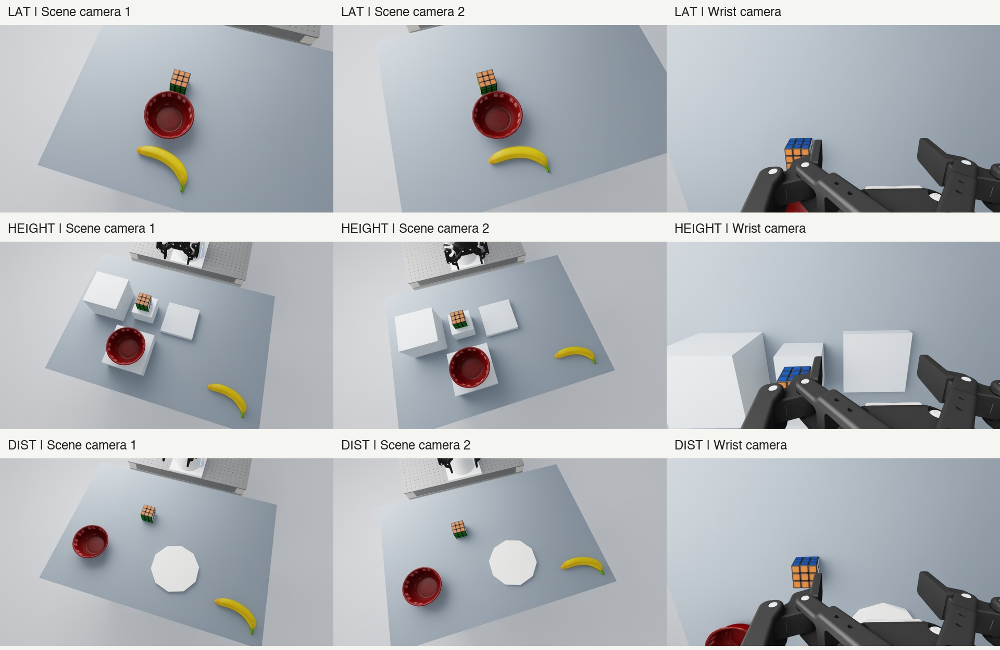

# Closer cameras and alignment checks

The active exterior-camera revision is **`close-oblique-v3-full-objects-20260924`**.
Both views look down across the table from its far side. The wrist camera,
robot, clean lighting, objects, supports, physical goals, prompts and scoring
are unchanged. [Figure 10, page 14 of the TRI LBM paper](https://arxiv.org/html/2507.05331v1)
is the qualitative framing reference; its hardware and calibration were not
copied.



These are full initial simulator frames for LAT-P01, HEIGHT-P01 and DIST-P01,
resized without cropping. Columns show scene camera 1, scene camera 2 and the
unchanged wrist camera.

The prior v2 fitter and its validator excluded the banana. That was a coverage
bug: its bounding box fell outside several views. The new regression test
failed on v2 and passes after fitting every tabletop object. The more overhead
angle preserves useful object scale while including the banana in both views.
All previous camera images and receipts remain intact.

## Registered views

[`close_cameras.json`](../experiments/workshops/spatial_grounding_v1/close_cameras.json)
contains the exact positions, OpenGL quaternions and focal lengths for all 87
selected candidate IDs. Its SHA-256 is
`a7413451f7339c698fb4842bdb2007a59fb4f4bb8a8ebd97bf09355cbdc6d0f8`.

- Each exterior camera is offset `[+0.20, +/-0.06, +0.65]` metres from the
  registered focus, looking back toward the robot. The focus and common focal
  length are fitted to all initial tabletop object/support bounds, including the banana, both goal
  destinations and a 0.12 m cube-lift envelope, with at least 36 native pixels
  of geometric margin. No wording, selected goal or model outcome selects a view.
- Both exterior sensors remain 1280 x 720 RGB. The registered view is fixed
  across all six wording/goal conditions and all registered checkpoints within a layout.
- Sensor keys remain `over_shoulder_left_camera` and
  `over_shoulder_right_camera` for official slot compatibility. The names do
  not describe their new mounting positions. `wrist_cam` is unchanged.

## Completed checks

| Check | Evidence and result |
| --- | --- |
| All-layout geometric coverage | 87 layouts / 174 exterior views contain every tabletop object (including banana) and support, both destinations and the lift envelope. Minimum margin is 36.21 native pixels. This projects measured geometry; it is not 87 new rendered trials. |
| Native camera diagnostics | P01 and D01 in each family: 12 resets, 18 current-position hold steps, 30 observations and 90 camera samples. All passed. Six initial three-camera views were also inspected visually. |
| Sensor mapping and timing | Each observation equals the corresponding sensor RGB array exactly. All three sensors advance together at 15 Hz. Registered intrinsics/extrinsics and repeated reset poses agree. Sensor timestamps reset to zero. |
| Wrist attachment | The relative mount position stays within 0.1 mm of its configured offset; maximum observed error is about 0.016 mm. This is a held-position check, not a moving-arm sweep. |
| Official N3 input path | Hash-checked pure image helpers from the pinned service compose wrist above the two exteriors, then resize to 540 x 640. Each exterior occupies 180 x 320 pixels. Six native inputs and one asymmetric synthetic input pass slot and pixel checks. |
| Historical D1 input path | Pinned extraction, packing and `pad` resize pass for all three slots at 180 x 320. Asymmetric corner markers check orientation and slot order. No client/server or model was initialized. |
| Offline scene materialization | Camera source b7a5628 regenerates all 87 layouts and the earlier 1,044-cell queue with the new camera identity. This is a source-specific historical queue check; rematerialize the active model roster at current cluster paths. No simulator or model is run by the materializer. |
| Software | 21 focused camera, environment-binding and materializer tests passed on the isolated camera source. New model-roster changes are outside that test receipt. |

Projected initial cube widths at the 320 x 180 exterior input scale are:

| Family | Revised width | Gain over original view |
| --- | ---: | ---: |
| LAT | 20.8 px | 1.50-1.77x |
| HEIGHT | 14.5-18.2 px | 1.03-1.38x |
| DIST | 13.8-17.9 px | 1.06-1.44x |

These are projected bounding-box widths, not measurements of model accuracy.
DIST needs a broader field of view to include both destinations and references.

## Limits that matter for analysis

The 522 previous scripted goal trials establish feasibility of the unchanged
physical geometry. They were not repeated with these cameras. The new native
diagnostics contain no goal trials and no learned-policy episodes. All-layout
projection checks do not establish freedom from arm occlusion throughout a
trajectory. The tighter LAT view can crop the idle gripper above the task area.

The wrist camera still clips reference objects: the HEIGHT bowl center is
outside all 29 initial wrist images; DIST bowl/plate visibility depends on the
layout. The cube is within the projected wrist bounds in all 87 layouts.
Wrist-only forecasts without a visible reference cannot receive a supported
relational label. Record those labels as unavailable; do not discard or
reclassify physically scored policy failures.

The exterior cameras now face back toward the robot. Image left/right and
robot left/right are different frames, while the frozen prompts leave the
viewpoint implicit. Report both when inspecting reversals; a reversal alone
does not establish misunderstanding. Focal lengths and magnification differ
across families, so cross-family differences cannot isolate axis understanding.

Separate resets reproduce poses, not identical rendered pixels. Synchronized
sensor updates do not independently measure exposure latency. These checks
do not execute later learned image transforms, cluster model servers or
decoded futures. Actual prediction-camera and physical-time alignment remain
model-runtime work before prediction fidelity can be reported.

## Evidence and cluster use

The [compact current evidence](../artifacts/workshops/spatial_grounding_v1/camera_checks_20260924/close-v3-full-objects/)
includes the plan recorded before capture, six native receipts, raw initial
images, model-input previews, geometry/framing reports and the offline
preprocessing report. [The completion receipt](../handoff/camera-alignment.json)
indexes their hashes and raw recording locations. Full native observations,
reset evidence and logs remain on the workstation under
`/home/ali/sgw-scene-design-20260923/evidence/SGW-CLOSE-CAMERA-V3-20260924`.

The [original camera checks](../artifacts/workshops/spatial_grounding_v1/camera_checks_20260924/original/)
and [rejected first close view](../artifacts/workshops/spatial_grounding_v1/camera_checks_20260924/rejected-close-v1/)
are preserved. The first close view was rejected because the arm occluded the
HEIGHT cube. Native transform rounding exceeded an initial 10-micrometre
wrist diagnostic tolerance; the original analysis-revision receipt records
the change to 0.1 mm and the measured residual. No scene was altered to pass it.

The current [materialization receipt](../handoff/full-object-camera-materialization.json)
uses source `b7a56286c3f794c91d59e901c66515aa3f01f221` and writes
`/home/ali/sgw-scene-design-20260923/evidence/SGW-FULL-OBJECT-HANDOFF-20260924`.
Rematerialize at cluster paths using [SCENE_MATERIALIZATION.md](SCENE_MATERIALIZATION.md).
Bindings without the current camera revision/hash are rejected. Preserve the
original physical qualification, but do not use its superseded camera binding.

To reproduce the offline geometry reports from retained native captures:

```sh
uv run python tools/camera_checks/analyze.py . /path/to/SGW-CLOSE-CAMERA-V3-20260924 experiments/workshops/spatial_grounding_v1/close_cameras.json
uv run python -m tools.camera_checks.framing_report . /path/to/framing-report.json
```

The sensor count remains two exterior cameras plus the wrist camera. The existing
policy adapters consume those three images; adding a renderer-only camera would
not expand model observations. New checkpoint adapters still need their own
input qualification.

The preprocessing report records exact official helper hashes. It used Nano
source commit `411d25b2e35bc441126f48c44a4b93e1c0564274` and RoboLab/D1
source commit `0aef241fb088ca21bb4ebd24448940ed56620d17`. No learned-policy
study launch is authorized by this handoff.
