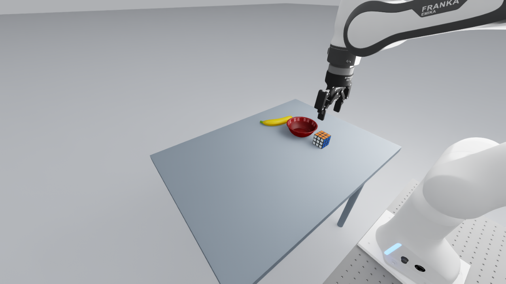
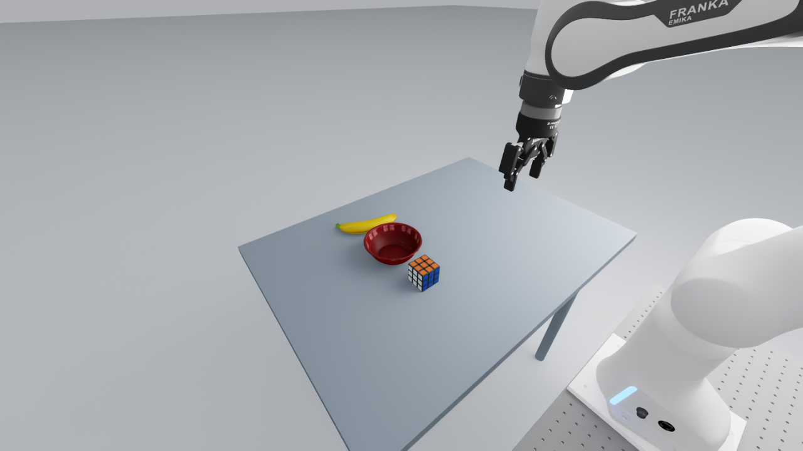
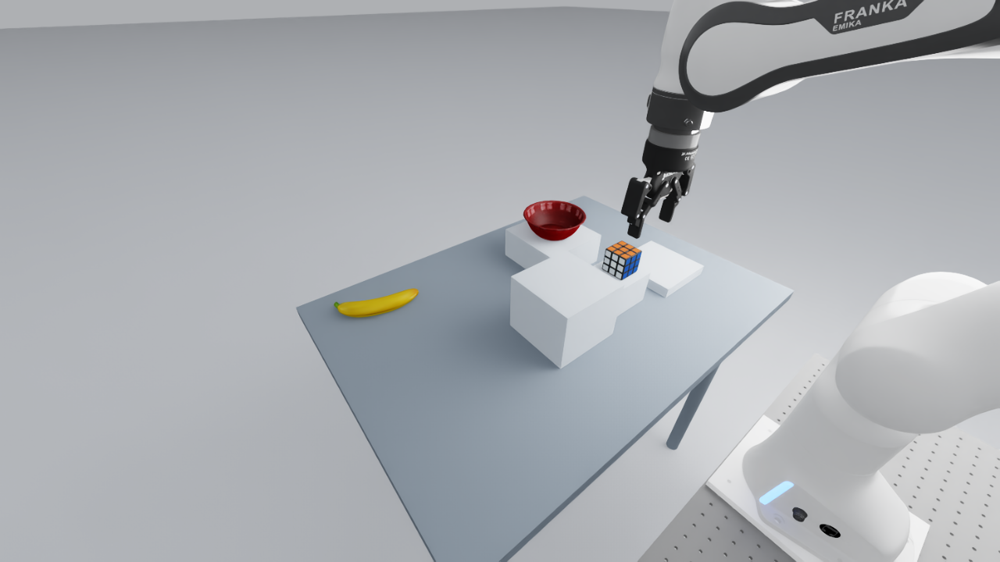
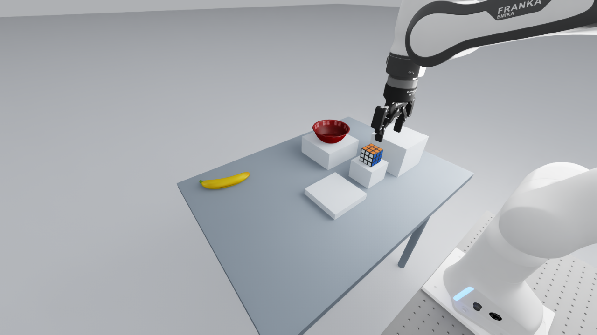
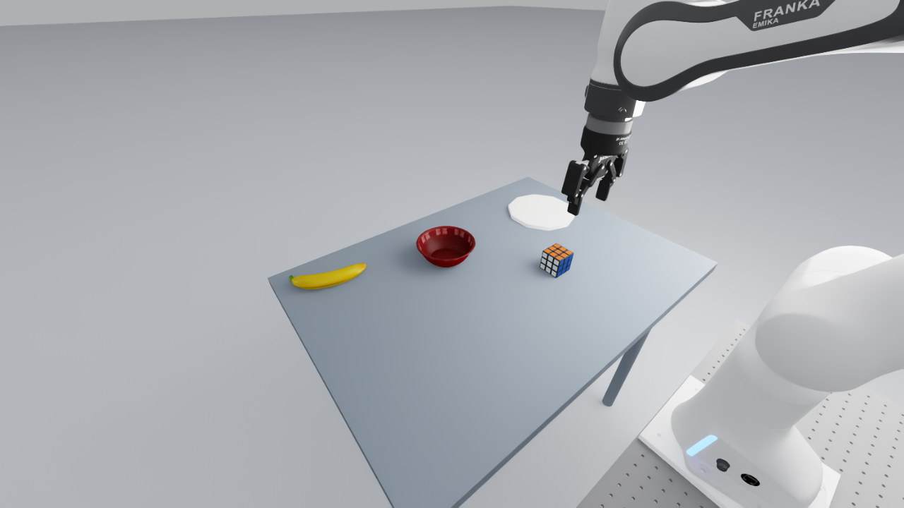
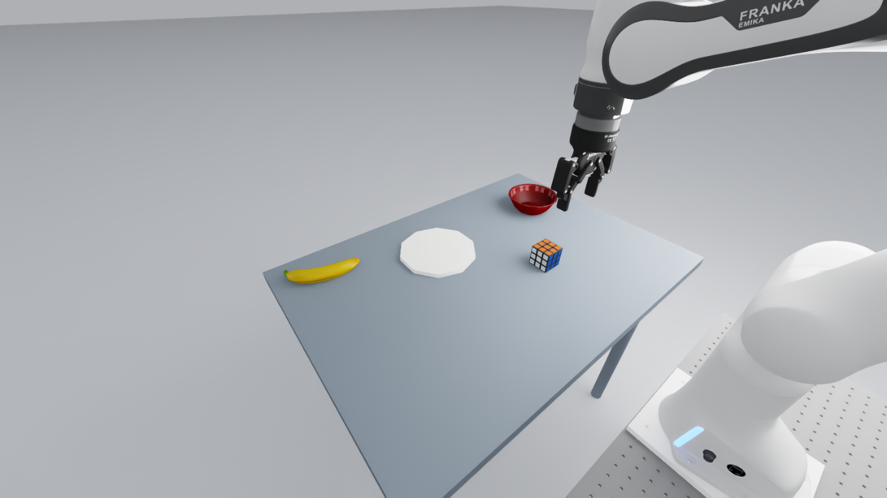

# Clean scene examples

The active study uses the closer exterior cameras shown below. All 87 selected
layouts retain their completed physical geometry qualification. Camera-only
diagnostics passed on six representative layouts; see
[CAMERA_ALIGNMENT.md](CAMERA_ALIGNMENT.md) for scope and evidence.

## Historical qualification images

The following original simulator captures belong to the scripted physical
trials. Their exterior-camera framing is superseded; they are retained as
evidence of the unchanged geometry. The qualification status below comes
from physical trial receipts, not the camera-only checks.

All scenes retain both shoulder cameras and the wrist camera. The images below are initial captures, not continuous recordings.

Original captures recorded before the closer-camera revision on 2026-09-24.

## Left / right: robot-right approach

**Scripted trials: 6/6 passed.** Both goals, three resets each.

[Right shoulder camera](../artifacts/workshops/spatial_grounding_v1/workstation_receipts_20260924/prototype-06-a/over_shoulder_right_camera.png)

[Wrist camera](../artifacts/workshops/spatial_grounding_v1/workstation_receipts_20260924/prototype-06-a/wrist_cam.png)

## Left / right: robot-left approach

**Scripted trials: 6/6 passed.** Both goals, three resets each.

[Right shoulder camera](../artifacts/workshops/spatial_grounding_v1/workstation_receipts_20260924/SGW-COMPLETION-PROTOTYPES-20260924/SGW-COMPLETE-20260924-LAT-LEFT-000/over_shoulder_right_camera.png)

[Wrist camera](../artifacts/workshops/spatial_grounding_v1/workstation_receipts_20260924/SGW-COMPLETION-PROTOTYPES-20260924/SGW-COMPLETE-20260924-LAT-LEFT-000/wrist_cam.png)

## Higher / lower: upper support on the left

**Scripted trials: 6/6 passed.** Both goals, three resets each.

[Right shoulder camera](../artifacts/workshops/spatial_grounding_v1/workstation_receipts_20260924/prototype-04-a/over_shoulder_right_camera.png)

[Wrist camera](../artifacts/workshops/spatial_grounding_v1/workstation_receipts_20260924/prototype-04-a/wrist_cam.png)

## Higher / lower: upper support on the right

**Scripted trials: 6/6 passed.** Both goals, three resets each.

[Right shoulder camera](../artifacts/workshops/spatial_grounding_v1/workstation_receipts_20260924/prototype-05-a/over_shoulder_right_camera.png)

[Wrist camera](../artifacts/workshops/spatial_grounding_v1/workstation_receipts_20260924/prototype-05-a/wrist_cam.png)

## Closer / farther, flat table: bowl on the left

**Scripted trials: 6/6 passed.** Both goals, three resets each.

[Right shoulder camera](../artifacts/workshops/spatial_grounding_v1/workstation_receipts_20260924/SGW-FLAT-DIST-PROTOTYPES-20260924-HEADLESS-A2/SGW-FLAT-DIST-LEFT-000/over_shoulder_right_camera.png)

[Wrist camera](../artifacts/workshops/spatial_grounding_v1/workstation_receipts_20260924/SGW-FLAT-DIST-PROTOTYPES-20260924-HEADLESS-A2/SGW-FLAT-DIST-LEFT-000/wrist_cam.png)

## Closer / farther, flat table: bowl on the right

**Scripted trials: 6/6 passed.** Both goals, three resets each.

[Right shoulder camera](../artifacts/workshops/spatial_grounding_v1/workstation_receipts_20260924/SGW-FLAT-DIST-PROTOTYPES-20260924-HEADLESS-A2/SGW-FLAT-DIST-RIGHT-000/over_shoulder_right_camera.png)

[Wrist camera](../artifacts/workshops/spatial_grounding_v1/workstation_receipts_20260924/SGW-FLAT-DIST-PROTOTYPES-20260924-HEADLESS-A2/SGW-FLAT-DIST-RIGHT-000/wrist_cam.png)
