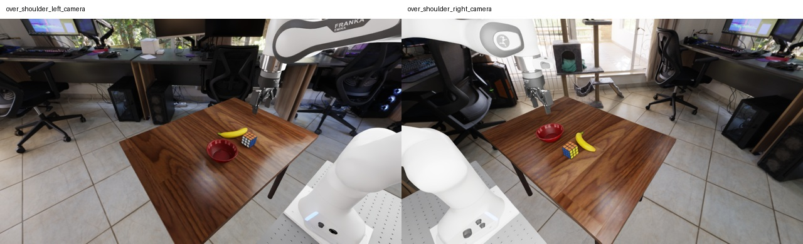
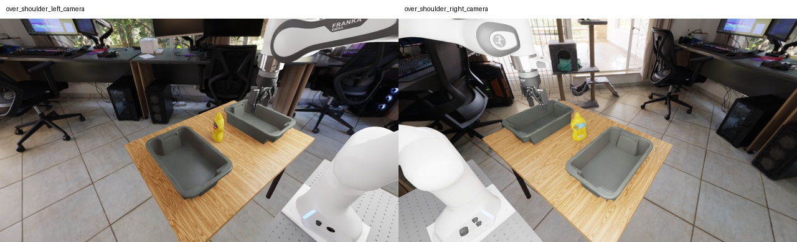
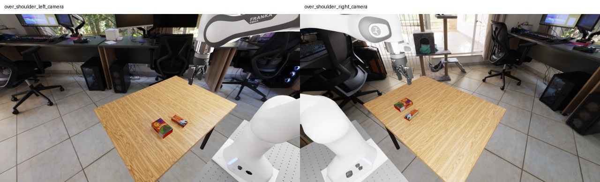
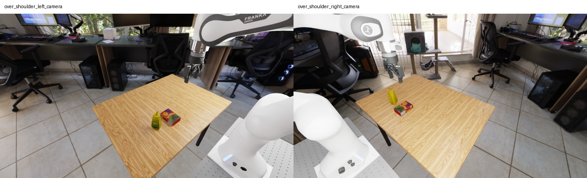
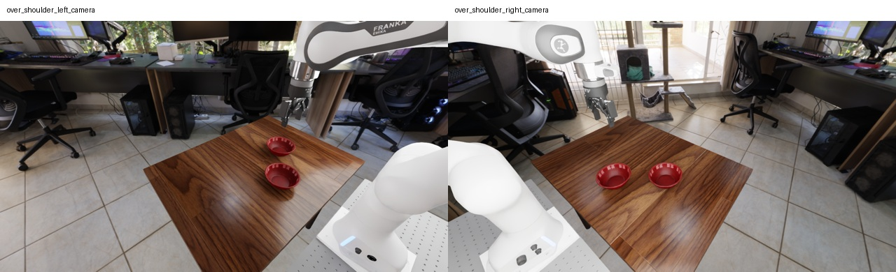
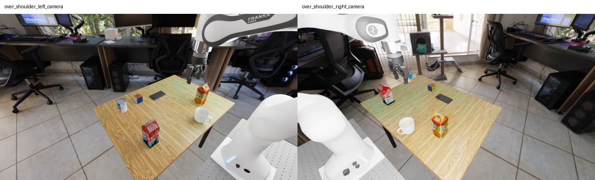

# Scenes and exact prompts: RoboLab world-action study

**Start here. Draft for discussion; no new runs launched.**

## The question we are asking

Can a world-action model's predicted future help distinguish following the wrong goal from failing to execute the right one?

We will use language as a controlled intervention, then compare the generated future with the action actually executed. A task failure alone cannot distinguish an incorrect goal from unsuccessful manipulation. This document specifies the intervention before the study.

## How to read the prompt groups

- **Different rows/goals:** genuine goal counterfactuals. The requested destination, relation or manipulated object changes.
- **D, S and I within one goal:** the intended physical goal is held fixed. The wording changes.
- **Native nominal:** copied exactly from the pinned RoboLab task, not rewritten by us.
- **Study-added goal:** a new instruction/scoring condition on an existing RoboLab scene, not a native benchmark result.
- **Optional:** proposed extensions, excluded from the primary budget.

**Primary proposal: 5 existing scenes, 14 goals, 42 exact prompts.** The mug scene contributes 9 held prompts, and 5 additional prompts are optional. This is not an execution-ready release.

Directions use the robot frame. Predicates and actual object bindings are recorded per reset. A goal already true at reset is a maintenance case, reported separately from achieving a new goal. On-top / inside language cannot be scored by a 2D image alone.

## S1. Cube, bowl and banana

**Image:** the first raw policy observation from the September 26 pilot, before its first action. Left and right shoulder views are shown; the policy also receives a wrist image. These are stock RoboLab backgrounds and cameras, not the earlier clean-scene package.

**Scene:** `rubiks_cube_banana_bowl.usda`. **Status:** core.

**RoboLab nominal prompt(s), verbatim:**

- `RubiksCubeLeftOfBowlTask`: "Put the rubiks cube to the left of the bowl"
- `RubiksCubeInFrontOfBowlTask`: "Put the rubiks cube in front of the bowl"
- `RubiksCubeBehindBowlTask`: "Put the rubiks cube behind the bowl"

**What this scene tests:** Does the predicted and executed cube placement follow four distinct directions, and survive an equivalent reversal of the reference wording?

**Important distinction:** The stock RubiksCubeRightOfBowlTask loads rubiks_cube_banana_bowl_mug_bin.usda, a DIFFERENT scene. We use the simple scene shown here for all four goals. Right is a study-added goal on this scene; it is not a paired run of that stock task.

### Goal S1-L: Cube left of bowl

Origin: **native on this scene**. Manipulated object: `rubiks_cube`. Reference/destination: `bowl`.

| ID | Form | Exact prompt |
|---|---|---|
| S1-L-D | D | Put the rubiks cube to the left of the bowl |
| S1-L-S | S | Place the Rubik's cube so that the Rubik's cube is to the left of the bowl. |
| S1-L-I | I | Place the Rubik's cube so that the bowl is to the right of the Rubik's cube. |

### Goal S1-R: Cube right of bowl

Origin: **study-added goal; native right wording reused on fixed simple scene**. Manipulated object: `rubiks_cube`. Reference/destination: `bowl`.

| ID | Form | Exact prompt |
|---|---|---|
| S1-R-D | D | Put the rubiks cube to the right of the bowl |
| S1-R-S | S | Place the Rubik's cube so that the Rubik's cube is to the right of the bowl. |
| S1-R-I | I | Place the Rubik's cube so that the bowl is to the left of the Rubik's cube. |

### Goal S1-F: Cube in front of bowl

Origin: **native on this scene**. Manipulated object: `rubiks_cube`. Reference/destination: `bowl`.

| ID | Form | Exact prompt |
|---|---|---|
| S1-F-D | D | Put the rubiks cube in front of the bowl |
| S1-F-S | S | Place the Rubik's cube so that the Rubik's cube is in front of the bowl. |
| S1-F-I | I | Place the Rubik's cube so that the bowl is behind the Rubik's cube. |

### Goal S1-B: Cube behind bowl

Origin: **native on this scene**. Manipulated object: `rubiks_cube`. Reference/destination: `bowl`.

| ID | Form | Exact prompt |
|---|---|---|
| S1-B-D | D | Put the rubiks cube behind the bowl |
| S1-B-S | S | Place the Rubik's cube so that the Rubik's cube is behind the bowl. |
| S1-B-I | I | Place the Rubik's cube so that the bowl is in front of the Rubik's cube. |

### Optional additional goal tests

**S1-X-NEAR:** "Move the Rubik's cube onto the table so that it is closer to the robot base than the bowl is."

New radial-distance goal. Not an assumed synonym for in front of; requires its own distance predicate.

**S1-X-FAR:** "Move the Rubik's cube onto the table so that it is farther from the robot base than the bowl is."

Opposite radial-distance goal. Hold the bowl fixed; use robot-base distance, not camera depth.

**S1-X-OBJECT:** "Put the banana to the left of the bowl."

Change the manipulated object while preserving the left-of relation. Requires banana feasibility and object-specific scoring.

## S2. Mustard and two bins

**Image:** the first raw policy observation from the September 26 pilot, before its first action. Left and right shoulder views are shown; the policy also receives a wrist image. These are stock RoboLab backgrounds and cameras, not the earlier clean-scene package.

**Scene:** `two_bin.usda`. **Status:** core.

**RoboLab nominal prompt(s), verbatim:**

- `MustardInLeftBinTask`: "Put the mustard in the left bin"
- `MustardInRightBinTask`: "Put the mustard in the right bin"

**What this scene tests:** Does language select the correct destination, and does the predicted transfer actually end in containment?

**Important distinction:** Left and right identify the bins at reset in the robot frame. Both goals use the same physical reset. The pilot moved mustard in opposite directions but missed both bins.

### Goal S2-L: Mustard in left bin

Origin: **native**. Manipulated object: `mustard`. Reference/destination: `grey_bin_left`.

| ID | Form | Exact prompt |
|---|---|---|
| S2-L-D | D | Put the mustard in the left bin |
| S2-L-S | S | Place the mustard so that the mustard is inside the left bin. |
| S2-L-I | I | Place the mustard so that the left bin contains the mustard. |

### Goal S2-R: Mustard in right bin

Origin: **native**. Manipulated object: `mustard`. Reference/destination: `grey_bin_right`.

| ID | Form | Exact prompt |
|---|---|---|
| S2-R-D | D | Put the mustard in the right bin |
| S2-R-S | S | Place the mustard so that the mustard is inside the right bin. |
| S2-R-I | I | Place the mustard so that the right bin contains the mustard. |

### Optional additional goal tests

**S2-X-BETWEEN:** "Place the mustard on the table between the two bins."

New destination, not a paraphrase of either bin task. Tests two-reference localization; requires a predefined bounded between region.

## S3. Butter box and raisin box

**Image:** the first raw policy observation from the September 26 pilot, before its first action. Left and right shoulder views are shown; the policy also receives a wrist image. These are stock RoboLab backgrounds and cameras, not the earlier clean-scene package.

**Scene:** `butter_raisin_box.usda`. **Status:** core.

**RoboLab nominal prompt(s), verbatim:**

- `ButterAboveRaisinTask`: "Pick up the butter box and place it on top of the raisin box"

**What this scene tests:** Does the model distinguish supported placement on the box from placement beside it, and keep the intended object fixed under reversed wording?

**Important distinction:** On top means supported placement, not hovering above. Left/right are new goals on the same existing scene; their physical feasibility and scoring must be checked before collection. This is not a pure height ablation: support and contact also change.

### Goal S3-TOP: Butter box on raisin box

Origin: **native**. Manipulated object: `butter`. Reference/destination: `raisin_box`.

| ID | Form | Exact prompt |
|---|---|---|
| S3-TOP-D | D | Pick up the butter box and place it on top of the raisin box |
| S3-TOP-S | S | Place the butter box so that the butter box is on top of and supported by the raisin box. |
| S3-TOP-I | I | Place the butter box so that the raisin box is underneath and supporting the butter box. |

### Goal S3-L: Butter box left of raisin box

Origin: **study-added goal**. Manipulated object: `butter`. Reference/destination: `raisin_box`.

| ID | Form | Exact prompt |
|---|---|---|
| S3-L-D | D | Place the butter box on the table to the left of the raisin box. |
| S3-L-S | S | Move the butter box on the table so that the butter box is to the left of the raisin box. |
| S3-L-I | I | Move the butter box on the table so that the raisin box is to the right of the butter box. |

### Goal S3-R: Butter box right of raisin box

Origin: **study-added goal**. Manipulated object: `butter`. Reference/destination: `raisin_box`.

| ID | Form | Exact prompt |
|---|---|---|
| S3-R-D | D | Place the butter box on the table to the right of the raisin box. |
| S3-R-S | S | Move the butter box on the table so that the butter box is to the right of the raisin box. |
| S3-R-I | I | Move the butter box on the table so that the raisin box is to the left of the butter box. |

## S4. Mustard bottle and raisin box

**Image:** the first raw policy observation from the September 26 pilot, before its first action. Left and right shoulder views are shown; the policy also receives a wrist image. These are stock RoboLab backgrounds and cameras, not the earlier clean-scene package.

**Scene:** `mustard_raisin_box.usda`. **Status:** core.

**RoboLab nominal prompt(s), verbatim:**

- `MustardAboveRaisinTask`: "Place the mustard on the raisin box. "

The native mustard prompt includes one trailing space after the period; the JSON preserves it exactly.

**What this scene tests:** Does the model distinguish supported placement on the box from placement beside it, and keep the intended object fixed under reversed wording?

**Important distinction:** On top means supported placement, not hovering above. Left/right are new goals on the same existing scene; their physical feasibility and scoring must be checked before collection. This is not a pure height ablation: support and contact also change.

### Goal S4-TOP: Mustard bottle on raisin box

Origin: **native**. Manipulated object: `mustard_bottle`. Reference/destination: `raisin_box`.

| ID | Form | Exact prompt |
|---|---|---|
| S4-TOP-D | D | Place the mustard on the raisin box.  |
| S4-TOP-S | S | Place the mustard bottle so that the mustard bottle is on top of and supported by the raisin box. |
| S4-TOP-I | I | Place the mustard bottle so that the raisin box is underneath and supporting the mustard bottle. |

### Goal S4-L: Mustard bottle left of raisin box

Origin: **study-added goal**. Manipulated object: `mustard_bottle`. Reference/destination: `raisin_box`.

| ID | Form | Exact prompt |
|---|---|---|
| S4-L-D | D | Place the mustard bottle on the table to the left of the raisin box. |
| S4-L-S | S | Move the mustard bottle on the table so that the mustard bottle is to the left of the raisin box. |
| S4-L-I | I | Move the mustard bottle on the table so that the raisin box is to the right of the mustard bottle. |

### Goal S4-R: Mustard bottle right of raisin box

Origin: **study-added goal**. Manipulated object: `mustard_bottle`. Reference/destination: `raisin_box`.

| ID | Form | Exact prompt |
|---|---|---|
| S4-R-D | D | Place the mustard bottle on the table to the right of the raisin box. |
| S4-R-S | S | Move the mustard bottle on the table so that the mustard bottle is to the right of the raisin box. |
| S4-R-I | I | Move the mustard bottle on the table so that the raisin box is to the left of the mustard bottle. |

## S5. Two bowls

**Image:** the first raw policy observation from the September 26 pilot, before its first action. Left and right shoulder views are shown; the policy also receives a wrist image. These are stock RoboLab backgrounds and cameras, not the earlier clean-scene package.

**Scene:** `bowls_2_table.usda`. **Status:** core.

**RoboLab nominal prompt(s), verbatim:**

- `BowlStackingLeftOnRightTask`: "Stack the left bowl on the right bowl"
- `BowlStackingRightOnLeftTask`: "Stack the right bowl on the left bowl"

**What this scene tests:** When the two objects look alike, does the model predict and move the requested bowl, or act on the other one?

**Important distinction:** Bind left/right bowl identities at reset, using the robot frame. In the recorded layout left is bowl_2 and right is bowl_1; recompute bindings after any layout change. Opposite stacking goals change BOTH mover and support. They are not equivalent descriptions and are not a pure direction ablation.

### Goal S5-LR: Left bowl onto right bowl

Origin: **native**. Manipulated object: `bowl_2`. Reference/destination: `bowl_1`.

| ID | Form | Exact prompt |
|---|---|---|
| S5-LR-D | D | Stack the left bowl on the right bowl |
| S5-LR-S | S | Move the left bowl so that the left bowl is stacked on the right bowl. |
| S5-LR-I | I | Move the left bowl so that the right bowl is underneath and supporting the left bowl. |

### Goal S5-RL: Right bowl onto left bowl

Origin: **native**. Manipulated object: `bowl_1`. Reference/destination: `bowl_2`.

| ID | Form | Exact prompt |
|---|---|---|
| S5-RL-D | D | Stack the right bowl on the left bowl |
| S5-RL-S | S | Move the right bowl so that the right bowl is stacked on the left bowl. |
| S5-RL-I | I | Move the right bowl so that the left bowl is underneath and supporting the right bowl. |

## S6. White mug and table center

**Image:** the first raw policy observation from the September 26 pilot, before its first action. Left and right shoulder views are shown; the policy also receives a wrist image. These are stock RoboLab backgrounds and cameras, not the earlier clean-scene package.

**Scene:** `objects_around_table.usda`. **Status:** hold; excluded from primary study.

**RoboLab nominal prompt(s), verbatim:**

- `WhiteMugInCenterOfTableTask`: "Put the white mug in the center of the table."

**What this scene tests:** Can the model target a region instead of another object, and preserve that target across descriptions?

**Important distinction:** ON HOLD. In the pilot, the bowl and banana were already far below the table at the first policy observation. Keep the 1/1 native success as a pilot result with this caveat. No confirmation episodes until reset validity is repaired and versioned. Image shows the actual incomplete pilot reset.

### Goal S6-C: Mug at center

Origin: **native**. Manipulated object: `mug`. Reference/destination: `table`.

| ID | Form | Exact prompt |
|---|---|---|
| S6-C-D | D | Put the white mug in the center of the table. |
| S6-C-S | S | Place the white mug so that the white mug rests at the center of the table. |
| S6-C-I | I | Place the white mug so that the center of the table is directly underneath the white mug, with the mug resting on the table. |

### Goal S6-L: Mug left of center

Origin: **study-added goal**. Manipulated object: `mug`. Reference/destination: `table_center`.

| ID | Form | Exact prompt |
|---|---|---|
| S6-L-D | D | Place the white mug on the table to the left of its center. |
| S6-L-S | S | Move the white mug on the table so that the white mug is to the left of the table center. |
| S6-L-I | I | Move the white mug on the table so that the table center is to the right of the white mug. |

### Goal S6-R: Mug right of center

Origin: **study-added goal**. Manipulated object: `mug`. Reference/destination: `table_center`.

| ID | Form | Exact prompt |
|---|---|---|
| S6-R-D | D | Place the white mug on the table to the right of its center. |
| S6-R-S | S | Move the white mug on the table so that the white mug is to the right of the table center. |
| S6-R-I | I | Move the white mug on the table so that the table center is to the left of the white mug. |

### Optional additional goal tests

**S6-X-OBJECT:** "Put the Rubik's cube in the center of the table."

Change the manipulated object while preserving the destination; held with this entire scene.

## What we deliberately do not call equivalent

- "Do not put it left" does not uniquely mean right; negation is not an opposite-goal control.
- "Behind" and "farther from the robot" use different geometry; distance prompts are a separate extension.
- "Above" can permit hovering, while "on top" requires support. We test supported placement explicitly.
- "Stack right on left" changes which bowl moves; reversing the sentence about the same stack does not.
- RoboLab vague/specific variants can add details or remove constraints; they are inventoried, not assumed to be clean paraphrases.

## Provenance and next document

- Native text and scene names: [pinned RoboLab task source](https://github.com/NVlabs/RoboLab/tree/0aef241fb088ca21bb4ebd24448940ed56620d17/robolab/tasks/benchmark).
- [All 29 native spatial task definitions](native_spatial_inventory.json), extracted from that pinned checkout. We focus on the six scenes with actual pilot recordings, rather than claiming to cover the full suite.
- [Exact strings and hashes for agents](prompt_matrix.json).
- [Paper question and design](PAPER_DESIGN.md) and [experiment requirements](EXPERIMENT_SPEC.md) are separate from this prompt catalog.
