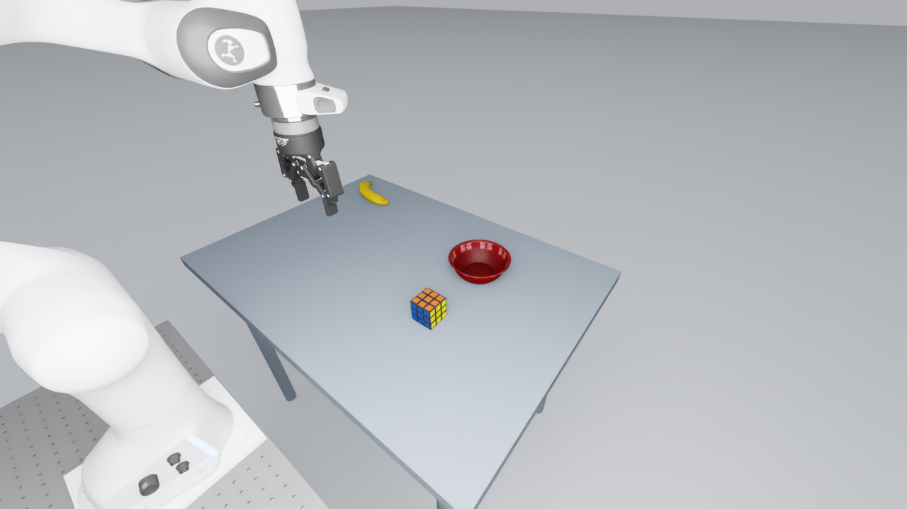
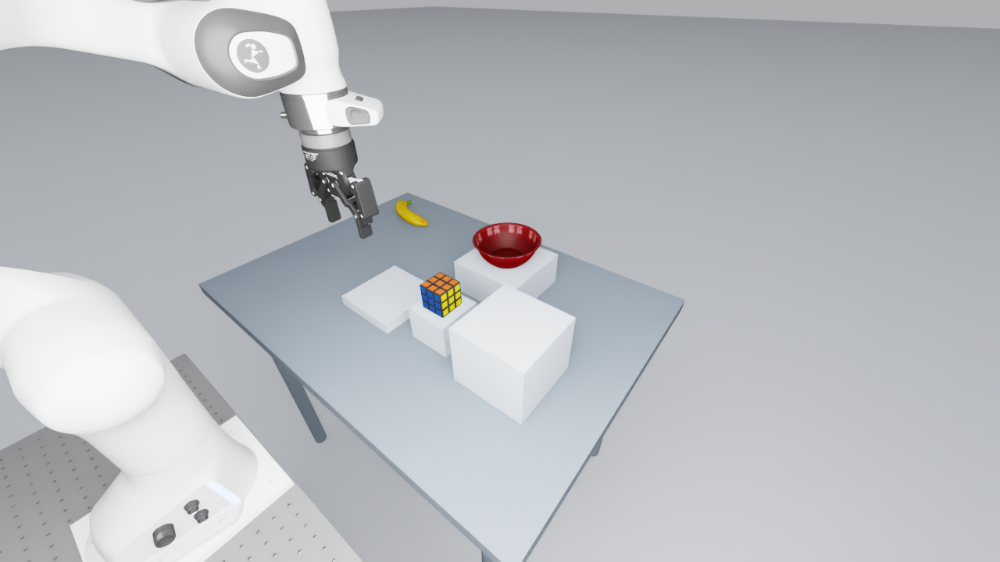

# Clean LAT, HEIGHT and DIST scene package

**Complete: 87 selected layouts, 29 per family, and 522 passing scripted trials. No learned-policy study launch is authorized.**

Use the [final registry](../../artifacts/workshops/spatial_grounding_v1/scene_package_20260924/scene-registry.json) and [completion receipt](../../handoff/physical-scene-completion.json). All three family quotas and their selection order are verified. Eight candidate rejections are retained; unused candidates need no further runs.

This directory documents the clean scenes for the WAM steerability workshop
paper. The scene package keeps the DROID robot, registered cameras, controller
and scoring criteria fixed. `clean-studio-v1` uses neutral illumination and
matte table/floor materials consistently across the matched comparisons.
LAT and DIST use a flat tabletop. Only HEIGHT has raised supports. Each wording
comparison starts from the same physical scene; removing DIST pedestals is a
design correction, not an additional measured ablation.

## Retained clean references

| Input | Family | Retained physical verification |
| --- | --- | --- |
| `prototype-03.json` | LAT | 5/6; valid strict terminal-stability rejection retained |
| `prototype-04.json` | HEIGHT, upper support left | 6/6 |
| `prototype-05.json` | HEIGHT, upper support right | 6/6 |
| `prototype-06.json` | LAT | 6/6 |

Inputs and their original clean registrations are in
[`scene_design_rtx_20260923`](../../artifacts/workshops/spatial_grounding_v1/scene_design_rtx_20260923/).
The compact native receipts are in
[`workstation_receipts_20260924`](../../artifacts/workshops/spatial_grounding_v1/workstation_receipts_20260924/).
A six-trial physical pass is a scene-feasibility result, not learned-policy
performance or proof that a complete family has been selected.

## Current construction inputs

- [`clean_campaign_20260924`](../../artifacts/workshops/spatial_grounding_v1/clean_campaign_20260924/)
  preserves the finite LAT/HEIGHT pool and its original plan bytes.
- [`completion_prototypes_20260924`](../../artifacts/workshops/spatial_grounding_v1/completion_prototypes_20260924/)
  contains the complementary LAT approach-side input and superseded pedestal
  DIST inputs. The pedestal DIST attempts are excluded from selection.
- [`flat_dist_prototypes_20260924`](../../artifacts/workshops/spatial_grounding_v1/flat_dist_prototypes_20260924/)
  records the flat-table DIST revision in both orientations.
- [`balanced_flat_scene_candidates_20260924`](../../artifacts/workshops/spatial_grounding_v1/balanced_flat_scene_candidates_20260924/)
  contains the prospective candidate inputs and selection plan for the balanced
  scene package. Authored rows are not qualified layouts.

The completed set has 29 distinct layouts per family: one pilot, four development and
24 confirmation. LAT approach side, HEIGHT upper-support side and DIST bowl
side have explicit quotas: two per side for development and twelve per side
for confirmation, plus the declared pilot side. Each selected layout requires
both goals across three complete resets and 450 actions per trial. Preserve
all clean candidate failures and partial evidence; do not replace unsuccessful
rows with undeclared retries.

See [COMPLETION_PLAN.md](COMPLETION_PLAN.md) for the construction work and
[ABLATION_COVERAGE.md](ABLATION_COVERAGE.md) for the workshop comparisons.
Read the retained campaign's status/assignments and verification records for
actual progress rather than assuming completion from the presence of files.

## Reproduction and cluster handoff

Use the pinned external native environment described in
[STANDALONE_RUNTIME.md](../STANDALONE_RUNTIME.md). The measured workspace
`infrastructure/a40-20260922z-workspace.json` and
`controller_calibrations/lat-closed-pad-20260923.json` remain scientific input
measurements. Their byte identities and clean registered plan bytes are kept.

`run-scene.sh` and `run-completion-scene.sh` are the source-bound launchers for
the registered scene runs. They remain unchanged because plans hash them;
they are not instructions to launch another run from this README. Native
execution must use the exact planned source and an explicitly authorized
finite workload. CPU preparation does not require a simulator or GPU.

For the eventual cluster transfer, carry selected design JSON, layout mappings,
measured poses, camera/asset identities, calibration and qualification receipts
together. Regenerate absolute USD sublayer paths against the target RoboLab
checkout. Keep raw arrays and rollout videos on persistent storage, outside
ordinary Git. A portable input package does not establish target-runtime
qualification.

The intended learned-policy cohort is clean-only and separately named, with
1,566 planned cells. See [CLEAN_SCENE_COHORT.md](../CLEAN_SCENE_COHORT.md) and
[CLUSTER_HANDOFF.md](../CLUSTER_HANDOFF.md). The learned-policy study remains
unlaunched by this repository preparation.
