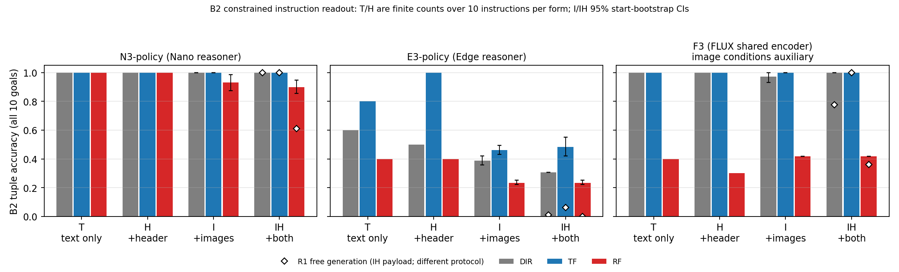
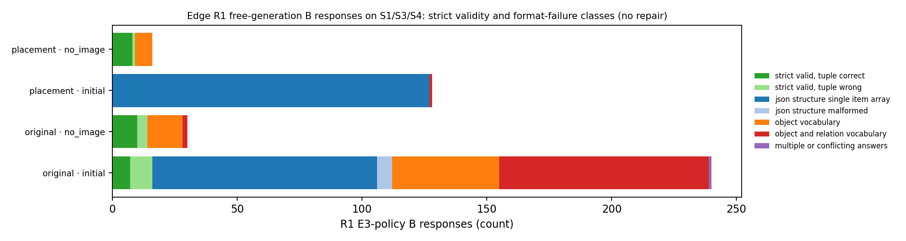
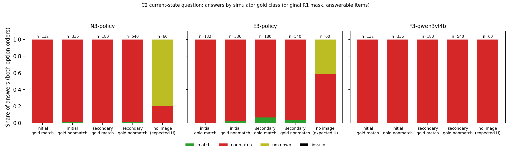

# RQA V2 — final bounded follow-up: separate results report

**Study:** RQA-20261006 · **Design:** v2.0 ([specification](../../../../docs/robolab-vqa-20261006/v2-final/FINAL_EXECUTION_SPEC.md), [protocol](../../../../docs/robolab-vqa-20261006/v2-final/protocol.json))
· **Run:** `r2-final-20261007` · **Executed:** 2026-10-07 UTC (the evening of 2026-10-06 US Pacific)

**Status: COMPLETE · PARTIALLY MACHINE-REVIEWED · VISUAL CONCLUSIONS PROVISIONAL.**

- All 6,552 planned evaluation queries were delivered and format-valid: 0 missing, 0 invalid, 0 truncated, 0 retries.
- Visual answerability was reviewed by blinded **machine** agents only, for 36 of 72 view sets. No human reviewed any
  sheet.
- Nothing here has been inserted into any manuscript or Overleaf project.
- This bounded pass is final. There is no V3, even though C2 remained uninformative.

[Compact paper table](PAPER_TABLE.md) · [Interpretation](INTERPRETATION.md) · [All tables](TABLES.md) ·
[Completion receipt](COMPLETION_RECEIPT.json) · [Raw-artifact index](artifact_index.json) ·
[Run receipts](run_receipts_summary.json) · [Implementation record and amendments](../../../../docs/robolab-vqa-20261006/v2-final/IMPLEMENTATION_RECORD_V2.md) ·
[Frozen release r2-final](../../../../artifacts/robolab_vqa_20261006/release_r2_final/) ·
[Human-review packet](../../../../artifacts/robolab_vqa_20261006/release_r2_final/review_packet/) ·
[Unchanged R1 report](../r1-20261006/REPORT.md) · [Study overview (V1 vs V2)](../../REPORT.md)

## 1. Findings at a glance

| Protocol question | Finding (S1/S3/S4; original R1 mask unless stated) | Evidence | Status / limitation |
|---|---|---|---|
| 1. Does Edge recover instruction roles and relations when output syntax is enforced? | **Partly.** Format is valid by construction and objects are mostly named correctly (91–94% with images). Relations often fail: text-only 18/30 tuples, image + header 34.0% [31.7, 36.5] (TF 48.3%, RF 23.3%). Images lower accuracy: I − T −26.9 pp [−28.9, −24.8]. R1's 2.4% strict score was mostly a format failure (90.6% of R1 B responses unparseable), but instruction difficulty remains. | §4, §5, [Fig. 1](figures/fig1_b2_conditions.png), [Fig. 3](figures/fig3_edge_format_audit.png) | R1 vs V2 is a decoding-protocol comparison. B2 scoring does not depend on answerability. |
| 2. Does adding image content, camera-orientation text, or both change instruction interpretation? | **N3:** images, not camera text, are associated with reference-first converse errors. IH − H RF −10.1 pp [−14.6, −5.2]; I − T RF −6.9 [−12.5, −1.4]; H − T 0 discordant of 30; IH − I RF −3.1 [−8.0, +1.7] (unresolved). **F3:** RF errors are already in the text path (T RF 4/10, all converse) and images (auxiliary) leave them unchanged. **E3:** images reduce every form. | §4.3, [Fig. 1](figures/fig1_b2_conditions.png) | The N3 effect sits in 2 of 10 RF instructions. QA-interface behavior only. |
| 3. With a direct current-state question and counterbalanced answer codes, can the readouts distinguish matching from nonmatching arrangements? | **No, uninformative.** Answers were near-constant "does not match": balanced accuracy 48.5–50.1%, match recall 0–5.2%, both frames of a truth-changing pair correct in ≤ 1/11. There were no U answers with images. The bias is semantic, not positional: answers kept their meaning when the codes swapped. V1's primary C stays uninformative. | §6, [Fig. 2](figures/fig2_c2_answers.png) | A null measurement, retained; the pass stops. |
| 4. Which visual items are answerable from the supplied views? | **Partly answered, by machine review of half the sheets.** Blinded agents reviewed 36 of 72 view sets (120 of 240 frame–goal items). Every reviewed initial-frame item (39/39) was answerable. Only 27 of 81 reviewed secondary-frame items were answerable for every reviewer; the rest had gripper contact or transit, occlusion, boundary or other ambiguity. No item judged answerable contradicted the simulator geometry. With unreviewed items counted as unanswerable (frozen rule), C2 stays at 48.3–50.0% balanced accuracy. | §7, [TABLES §10](TABLES.md) | Machine review only, so provisional. 7 of 12 reviewer agents failed without forms, and 1 form was excluded (evaluated-model use). A human packet and CPU rescore path are delivered. |

**Relation to the robot result.** The original policy wording effect remains the central result: TF − RF stable-ever
success of +14.6 pp [+8.1, +21.1] (N3), +8.1 [+3.6, +12.8] (E3) and +13.8 [+7.6, +20.1] (F3). The component-level
asymmetries above share its direction. They are measured in a QA interface and do not establish the policies'
internal computation (§8).

## 2. Run identity and evidence status

| Field | Value |
|---|---|
| Run ID / UTC timeline (2026-10-07) | `r2-final-20261007`. Release frozen 01:34. Freeze commit `30d833f` pushed about 01:36, before any evaluation query. Amendment V2-A1 `b63a93f` pushed about 01:40. Qualification 01:40:31–01:42:15. Evaluation 01:42:04–01:51:56. Analysis (original mask) 13:15. Machine review: first launch 01:36 produced no forms (outage); relaunch 13:10, forms written 14:45–15:06, remaining agents failed 15:15–16:10. Reviewed-mask analysis 16:13; report assets 16:16. |
| Release | Content SHA256 `2a3d5d69aca622519dbf67fd8a7931741bdad1c3483197013ad3ea662f8cf4f6`; `release.json` `297f8a77e2d781a74e4b4d23e60ff300fedbd7b907dc2a266ecf9f34e3b9cdc0`. Validation passed 27/27 checks ([validation.json](../../../../artifacts/robolab_vqa_20261006/release_r2_final/validation.json)). Source R1 release `1e691df6…` verified unchanged; images are R1's lossless inputs. |
| Commits | `515bab8` implementation · `30d833f` frozen release, queries, schemas and review packet · `b63a93f` Amendment V2-A1 (the runner used for every generation) · `66fac90` analysis driver and Edge audit, committed before the first analysis run · `85df14a`, `a3511fb`, `6802bea` CPU report generator (presentation only; final assets generated with `6802bea`) · results/report commit recorded in [RUN_INDEX.json](../../RUN_INDEX.json) |
| Readouts and loaded-parameter digests (all equal to R1) | N3-policy `eb00cb16…` (642 parameters) · E3-policy `d5a61863…` (506; documented packaging-only loader fix `rqa-adapter-1` and config view) · F3-qwen3vl4b `866dddce…` (605) |
| Engine and decoding | vLLM 0.26.0, torch 2.11.0+cu130, transformers 5.14.1, xgrammar 0.2.3 structured outputs (`backend=xgrammar`, `disable_any_whitespace=true`). FLASH_ATTN, eager, BF16, greedy, ≤ 256 new tokens, thinking disabled, one completion, seed 6106. One NVIDIA B200 per lane. |
| Output constraints (frozen) | **B2:** JSON schema with exactly `target`, `reference`, `relation` in that order and no extra keys. Object enums are the full sorted scene vocabulary including distractors; there is no target ≠ reference constraint and no gold pruning. **C2:** choice grammar `A \| B \| U`. Grammar hashes are in [run_receipts_summary.json](run_receipts_summary.json). |
| Actual commands | [COMPLETION_RECEIPT.json](COMPLETION_RECEIPT.json) → `commands` (inference, Edge audit, analysis, review ingest, rescoring, report) |
| GPU time | **0.523 B200 GPU-hours of active process time.** Qualification took 89–104 s and evaluation 467–579 s per lane, with the three lanes in parallel. Pods were allocated about 01:10–13:12 UTC. They sat idle after 01:52 while the machine review waited out a workstation network outage; no generation occurred in that window. |
| Answerability review | **Machine, partial:** 36 of 72 view sets (120 of 240 frame–goal items) from 4 primary blinded-agent forms; 12 sheets reviewed twice. Mask `aa4f12d1…`. **Human:** not performed. |
| Deviations and amendments | V2-A1: a qualification record fault before any generation; its 3 aborted ledger entries are charged to retry slots 27–29. E1: analysis-code timing and machine-review relaunch. E2: partial machine-review coverage, the method-based exclusion of one review form, and reporting. See [IMPLEMENTATION_RECORD_V2.md](../../../../docs/robolab-vqa-20261006/v2-final/IMPLEMENTATION_RECORD_V2.md). |

## 3. Scope, coverage and budget

**Scope.** Three distinct readouts:

| Readout | Identity |
|---|---|
| N3-policy | Executed Nano reasoner, equal to Qwen3-VL-8B-Instruct |
| E3-policy | Executed Edge reasoner, equal to the Edge base reasoner |
| F3-qwen3vl4b | FLUX's frozen shared encoder, equal to Qwen3-VL-4B-Instruct. Its text-only B2 is the language-path test; its image tests are auxiliary. |

Data: S1/S3/S4 only, with 24 physical starts, 10 goals and 30 exact DIR/TF/RF instructions (byte-preserved, including
the trailing space in `S4-TOP-D`). There are 24 initial and 48 fixed secondary view sets of three synchronized views.
No S5 queries and no N3-base.

| Test (per lane) | Planned | Delivered | Valid | Missing | Answerable under the original mask |
|---|---:|---:|---:|---:|---|
| B2 original: T / H / I / IH | 30 / 30 / 240 / 240 | all | all | 0 | all (B2 is text-defined) |
| B2 placement: T / IH | 16 / 128 | all | all | 0 | all |
| C2 initial (2 orders) | 480 | 480 | 480 | 0 | 468 requests (234 items) |
| C2 secondary (2 orders) | 960 | 960 | 960 | 0 | 720 requests (360 items) |
| C2 no-image (2 orders) | 60 | 60 | 60 | 0 | control only |
| **Lane total** | **2,184** | **2,184** | **2,184** | **0** | |

All three lanes are identical in these counts: 6,552 of 6,552 overall. Every item was queried, including those
excluded by the R1 mask; exclusions are applied only at scoring, so denominators never drop silently.

The no-image payloads are deduplicated, so each is generated once and never counted once per start:

| No-image payload | Requests per lane |
|---|---:|
| B2 T / H | 30 each |
| Placement T | 16 |
| C2 no-image | 60 |

**Generation budget.**

| Item | Count |
|---|---:|
| Hard cap | 6,600 |
| Attempt-ledger entries | **6,573** |
| — evaluation | 6,552 |
| — qualification fixture generations | 18 |
| — aborted before generation (V2-A1) | 3 |
| Model generations | 6,570 |
| Infrastructure retries | 0 |
| Shared retry slots unused | 27 of 30 |

Unused capacity was not reassigned.

## 4. B2: format-aided instruction interpretation

B2 reads the instruction's (target, reference, relation) through schema-constrained JSON decoding. It is an
**assisted readout**: format compliance is guaranteed by construction, and semantic accuracy is reported separately.
Text-only results are finite counts over 10 deterministic instructions per form. Image results are macro-weighted
with 95% physical-start bootstrap intervals; some are degenerate where answers are identical across starts.

### 4.1 Text only (T: no images, no camera text; H: camera text kept)

| Readout | T: DIR / TF / RF (of 10) | T tuple | H: DIR / TF / RF | H tuple | Discordant TF/RF pairs (T; H) |
|---|---|---:|---|---:|---|
| N3-policy | 10 / 10 / 10 | 30/30 | 10 / 10 / 10 | 30/30 | none; none |
| E3-policy | 6 / 8 / 4 | 18/30 | 5 / 10 / 4 | 19/30 | 4 TF-only; 6 TF-only |
| F3-qwen3vl4b (language path) | 10 / 10 / 4 | 24/30 | 10 / 10 / 3 | 23/30 | 6 TF-only; 7 TF-only |

Every discordant TF/RF text pair was TF-correct and RF-wrong.

- **F3:** all 6 (T) and 7 (H) RF errors are the converse relation.
- **E3:** RF errors are 4 converse plus other relations. Its DIR and TF errors are other-relation choices.

### 4.2 Initial images (I: images without camera text; IH: images with camera text = the R1 B payload)

| Readout | I tuple | I TF / RF | I TF − RF, pp | IH tuple | IH TF / RF | IH TF − RF, pp |
|---|---|---|---|---|---|---|
| N3-policy | 97.7% [95.8, 99.5] | 100.0% / 93.1% [87.5, 98.6] | +6.9 [+1.4, +12.5] | 96.6% [95.1, 98.3] | 100.0% / 89.9% [85.4, 94.8] | +10.1 [+5.2, +14.6] |
| E3-policy | 36.1% [34.0, 38.2] | 46.2% / 23.3% | +22.9 [+18.8, +27.1] | 34.0% [31.7, 36.5] | 48.3% / 23.3% | +25.0 [+18.8, +31.9] |
| F3-qwen3vl4b *(aux.)* | 79.6% [78.2, 80.6] | 100.0% / 41.7% | +58.3 (degenerate) | 80.6% | 100.0% / 41.7% | +58.3 (degenerate) |

The 8 lateral/front-behind goals give the same picture (TABLES §3). For example, N3 IH RF is 86.5% [80.2, 92.7].

### 4.3 Pixel and header contrasts (identical instruction text within each pair)

| Readout | Image I − T: all / RF | Image IH − H: all / RF | Header IH − I: all / RF | Header H − T (finite) |
|---|---|---|---|---|
| N3-policy | −2.3 [−4.2, −0.5] / **−6.9 [−12.5, −1.4]** | −3.4 [−4.9, −1.7] / **−10.1 [−14.6, −5.2]** | −1.0 [−2.7, +0.6] / −3.1 [−8.0, +1.7] | 0 discordant of 30 |
| E3-policy | **−26.9 [−28.9, −24.8]** / −21.2 [−22.2, −19.1] | **−30.8 [−33.1, −28.4]** / −21.2 [−22.2, −19.1] | −2.1 [−4.4, +0.7] / 0.0 | +1 (2 vs 1 of 30) |
| F3-qwen3vl4b *(aux.)* | −0.9 [−2.3, 0.0] / 0.0 | +3.7 / +11.1 (degenerate) | +0.9 [0.0, +2.3] / 0.0 | −1 (0 vs 1 of 30) |

**Method.** Paired contrasts reuse each no-image answer (one generation per instruction) against the eight initial
cells of that instruction, with identical bootstrap resamples. Their intervals are conditional on those fixed text-only
answers.

**What the contrasts support for N3.** Adding the camera images, not the camera-orientation sentences, is associated
with reference-first converse errors.

- Header text alone changed nothing.
- The header contrast with images present is unresolved: −3.1 [−8.0, +1.7] over all goals and −5.2 [−10.4, −1.0] on
  the lateral subset.
- This resolves the R1 confound, in which the IH payload always combined images and header text.

**Where N3's errors sit.** They are start-dependent converse answers in two of the ten RF instructions:

| RF instruction | Starts wrong, I (of 8) | Starts wrong, IH (of 8) |
|---|---:|---:|
| S3 "R" | 4 | 5 |
| S1 "B" | 0 | 3 |

I additionally has one S3 TOP support-label swap. The effect is therefore not wording-general.

These contrasts concern image content within the QA interface. They do not reveal the policy's internal action
computation.

### 4.4 Error taxonomy (image conditions; converse relations are kept separate from support-label swaps)

| Readout | Condition | RF errors | TF errors | DIR errors |
|---|---|---|---|---|
| N3-policy | I | 4 converse + 1 support-label swap | none | none |
| N3-policy | IH | 8 converse | none | none |
| F3-qwen3vl4b | I | 40 converse + 8 support-label swaps (S3 TOP) | none | 2 support-label swaps |
| F3-qwen3vl4b | IH | 40 converse + 8 support-label swaps | none | none |
| E3-policy | I | 63 (converse 22; target/reference swap + converse 25; other 16) | 41 | 48 |
| E3-policy | IH | 63 (converse 23; other 22; target/reference swaps 18) | 40 | 56 |

The F3 and E3 counts are over 80 items per form; the full table is TABLES §3.

### 4.5 Placement-only control (reference clause moved without converse words)

| Readout | Text-only (T) | Image + header (IH) |
|---|---:|---|
| N3-policy | 16/16 | 100% |
| F3-qwen3vl4b | 16/16 | 100% |
| E3-policy | 13/16 (reference-early 5/8, reference-late 8/8) | 50.5% [46.9, 54.2]; reference-early minus reference-late −17.7 pp [−25.0, −10.4] |

The placement controls are a different construction from RF wording and do not prove that all noun-order effects are
absent.

### 4.6 Cross-protocol reference (descriptive): R1 free generation versus V2 constrained decoding, same IH payload

| Readout | R1 B strict: tuple (DIR / TF / RF) | V2 B2 IH: tuple (DIR / TF / RF) |
|---|---|---|
| N3-policy | 87.0% (100.0 / 100.0 / 61.1) | 96.6% (100.0 / 100.0 / 89.9) |
| E3-policy | 2.4% (1.0 / 6.2 / 0.0) | 34.0% (30.6 / 48.3 / 23.3) |
| F3-qwen3vl4b | 71.3% (77.8 / 100.0 / 36.1) | 80.6% (100.0 / 100.0 / 41.7) |

These differences come from the decoding protocol, for example the fixed key order and enumerated vocabulary, not
from a model or training change. Do not read them as "free generation is repaired." TF > RF persists under both
protocols in every readout.



## 5. Edge format audit of existing R1 B responses (no new inference, no parser repair)

All 414 R1 E3-policy B requests on S1/S3/S4 were classified (original and placement families, no-image and initial
images). Strict R1 scores are unchanged.

| Family · bank | Requests | Strict-valid | Strict tuple correct | Main failure classes |
|---|---:|---:|---:|---|
| original · initial images | 240 | 16 | 7 | single-item JSON array 90, object + relation vocabulary 84, object vocabulary 43, malformed JSON 6, multiple answers 1 |
| original · no image | 30 | 14 | 10 | object vocabulary 14, object + relation vocabulary 2 |
| placement · initial images | 128 | 0 | 0 | single-item JSON array 127, object + relation vocabulary 1 |
| placement · no image | 16 | 9 | 8 | object vocabulary 7 |
| **All** | **414** | **39** | **25** | single-item array 217; object + relation vocabulary 87; object vocabulary 64; malformed 6; multiple 1; truncation 0 |

A descriptive alias mapping applied names and relations from the instruction wording; it is not a repair. Among
original-family format failures, it matched the gold tuple in:

| Form | Matched gold | Rate |
|---|---:|---:|
| DIR | 41 of 74 | 55% |
| TF | 54 of 76 | 71% |
| RF | 17 of 76 | 22% |

So R1's format failures concealed a TF > RF pattern similar to B2's. This does not show that every format failure was
semantically correct. Full table: TABLES §9; per-response raw excerpts:
[edge_format_audit.csv](results/edge_format_audit.csv).



## 6. C2: one fixed current-state question

C2 keeps R1's views, camera text and coordinate definitions, and replaces only the wrapper with the fixed V2 question.
There are two option orders: order 0 has A = match and B = nonmatch; order 1 exchanges them, and U (insufficient
evidence) stays in both. Correctness is averaged over the two orders within each item before aggregation.

### 6.1 Main endpoints (original R1 mask)

| Readout | Bank | Items scored | Balanced acc. [95% CI] | Recall match / nonmatch | TF − RF, pp | Same semantic answer across orders |
|---|---|---:|---|---|---|---:|
| N3-policy | initial | 234/240 | 49.4% [48.9, 49.8] | 0.0% / 98.8% | −0.5 [−1.6, 0.0] | 236/240 |
| N3-policy | secondary | 360/480 | 49.8% [49.4, 50.0] | 0.0% / 99.5% | 0.0 | 478/480 |
| E3-policy | initial | 234/240 | 48.5% [48.0, 49.0] | 0.0% / 97.0% | 0.0 | 235/240 |
| E3-policy | secondary | 360/480 | 50.1% [47.1, 53.1] | 5.2% / 95.1% | +1.3 [−0.9, +3.8] | 461/480 |
| F3-qwen3vl4b | initial | 234/240 | 50.0% | 0.0% / 100.0% | 0.0 | 240/240 |
| F3-qwen3vl4b | secondary | 360/480 | 50.0% | 0.0% / 100.0% | 0.0 | 480/480 |

Constant baselines: always-nonmatch gives balanced accuracy 50%, with accuracy 69.4% on the initial bank and 74.4% on
the secondary bank.

Answer distributions over all delivered image-conditioned answers:

| Readout | Initial: match / nonmatch / U | Secondary: match / nonmatch / U |
|---|---:|---:|
| N3 | 4 / 476 / 0 | 4 / 956 / 0 |
| E3 | 9 / 471 / 0 | 55 / 905 / 0 |
| F3 | 0 / 480 / 0 | 0 / 960 / 0 |

### 6.2 Reviewed masks (machine review, partial coverage)

Under the frozen rule, an item counts as answerable only if the R1 mask kept it and every machine reviewer marked it
answerable. Unreviewed items are unanswerable, so these scores cover the reviewed half of the sheets.

| Readout | Initial: items | Initial: balanced acc. [95% CI] | Initial: recall match | Secondary: items | Secondary: balanced acc. [95% CI] | Secondary: recall match |
|---|---:|---|---:|---:|---|---:|
| N3-policy | 117/240 | 49.7% [49.0, 50.0] | 0.0% | 69/480 | 50.0% [50.0, 50.0] | 0.0% |
| E3-policy | 117/240 | 48.3% [47.7, 48.7] | 0.0% | 69/480 | 48.7% [47.3, 50.0] | 0.0% |
| F3-qwen3vl4b | 117/240 | 50.0% | 0.0% | 69/480 | 50.0% | 0.0% |

- The strict mask is identical to the revised mask, because no reviewed answerable item contradicted geometry.
- The sensitivity mask that adds the excluded form 12 is also identical (TABLES §7).
- The reviewed masks leave 2 truth-changing pairs; 0 of 2 are classified correctly in every readout and form.
- The C2 null therefore does not depend on the mask.

### 6.3 Option-order check

- Each order alone also gives balanced accuracy ≈ 50% (TABLES §7).
- When A/B were exchanged, the letter flipped and the meaning ("does not match") held. The bias is semantic, not
  positional.
- By wording form, balanced accuracy ranges 45.5–52.5% (TABLES §7).

### 6.4 No-image control (camera text kept; expected answer U)

| Readout | Answers (of 60) | Notes |
|---|---|---|
| N3-policy | U 48, nonmatch 12 | RF 8 and TF 4 of the nonmatch answers |
| E3-policy | U 25, nonmatch 35 | |
| F3-qwen3vl4b | nonmatch 60 | A pure language prior |

When reused against the initial labels as a disclosed language-prior control, these answers do not explain the image
results. Every lane's image-conditioned answers are constant "does not match" anyway.

### 6.5 Truth-changing frame pairs (secondary temporal check)

There are 11 available pairs from 79 start–goals: the earliest match and the earliest nonmatch frame within the same
start and goal, with no substitutions.

| Readout | Both frames correct |
|---|---|
| N3 | 0 of 11 in every form |
| F3 | 0 of 11 in every form |
| E3 | 1 of 11 (TF and RF, in both orders); 0.5 of 11 order-averaged (DIR) |

Initial balanced accuracy alone cannot prove image use. This check finds no evidence of tracking change either.



**Conclusion.** C2 is uninformative, as V1's prespecified primary C was. The protocol's stop rule applies: the
result is retained, there was no prompt change after seeing answers, and there is no V3.

## 7. Answerability review (machine) and A rescore

### 7.1 Packet and blinding

The [review packet](../../../../artifacts/robolab_vqa_20261006/release_r2_final/review_packet/) (`packet_sha256`
`688d6284…`) holds 72 view sets and 240 frame–goal items, including the 14-frame fixed R1 second-review sample.

- **What reviewers saw:** the evaluation-resolution views, a camera legend, and neutral object/relation questions.
- **What was hidden:** model identity, model answers, action outcome, frame-selection provenance and simulator labels.
- **How labels were compared:** reviewers recorded their own visible relation and confidence. Comparison with the
  simulator labels happened afterwards, in CPU ingest (`review ingest`); no reviewer did it.
- **Mask rule:** frozen in code at `515bab8`, before evaluation.

### 7.2 Machine reviewers and what happened

Reviewer prompts were fixed at 01:36 UTC, before any evaluation response existed. The first launch produced no forms
because of a workstation network outage. At 13:10 UTC the same prompts were relaunched as 12 blinded agents: six sheet
sets of 12 sheets, two independent agents per set.

| Agent(s) | Sheet set | Result | Method (self-reported; [machine_reviewer_methods.json](review/machine_reviewer_methods.json)) | Mask use |
|---|---|---|---|---|
| 5 and 11 | 5 | Forms, 12 rows each | Viewed sheets with enlarged crops; 11 also measured arrows and positions | Primary |
| 9 | 3 | Form, 12 rows | After image-delivery failures, viewed per-sheet composites and triangulated positions numerically. It retracted earlier unsupported claims, which were not used. | Primary |
| 6 | 6 | Form, 12 rows | Image tool showed no pixels; judged by programmatic pixel analysis (OCR of sheet text, colour segmentation, arrow measurement) | Primary |
| 12 | 6 | Form, 12 rows | Image tool showed no pixels; pixel analysis, with a local **Qwen3-VL-8B** suggesting object locations | **Excluded from the primary mask**; sensitivity only |
| 1, 2, 3, 4, 7, 8, 10 | 1, 2, 3, 4 | Failed without forms (model-API DNS/timeout errors, 15:15–16:10 UTC) | — | — |

**Why form 12 was excluded.** Qwen3-VL-8B has the same weights as the evaluated N3-policy readout, and protocol §3
forbids evaluated models as judges. A form shaped by N3's own perception could, through the strict mask, remove exactly
the items N3 misjudges. The exclusion rule was decided on method alone, at 15:08 UTC, before the form's content was
examined. Re-running ingest with form 12 included yields identical revised and strict masks.

**Coverage.** Sheet sets 3, 5 and 6 are reviewed: 36 of 72 view sets, 12 initial and 24 secondary, covering 120 of
240 frame–goal items. Set 5 has two reviewers. Sets 1, 2 and 4 are unreviewed. Given repeated outages and the
requested speed, the pass finished with partial coverage rather than a third launch. Unreviewed items are
unanswerable in the reviewed masks; the original R1 mask remains primary.

### 7.3 Results of the review (primary forms)

| Labels | Bank | Reviewed items | R1-answerable | Answerable for every reviewer | Reviewers disagree on answerability | Revised = strict mask |
|---|---|---:|---:|---:|---:|---:|
| A | initial | 39 | 39 | 39 | 0 | 39 |
| A | secondary | 81 | 79 | 27 | 10 | 26 |
| C | initial | 39 | 39 | 39 | 0 | 39 |
| C | secondary | 81 | 62 | 27 | 6 | 23 |

Exclusion reasons over reviewer rows (C labels):

| Reason | Rows |
|---|---:|
| Other ambiguity | 40 |
| Transit or gripper contact | 29 |
| Relation not discernible | 26 |
| Occlusion | 16 |
| Boundary | 12 |
| Low confidence | 9 |
| Required table support not visible | 6 |

- **Agreement:** reviewers proposed the same visible relation on 116 of 120 items.
- **Geometry:** no item judged answerable contradicted the simulator geometry. The single proposed-label discrepancy
  was a boundary case already excluded by the R1 mask.

**Provisional reading.** The supplied views make the initial-state relations answerable, but many mid- and
late-rollout (secondary) frames are not. Secondary-bank C2 and A results should be read with that in mind.

Full detail: [TABLES §10](TABLES.md), [machine_review_items.csv](review/machine_review_items.csv),
[machine_review_ledger.csv](review/machine_review_ledger.csv), [machine_mask.json](review/machine_mask.json).

### 7.4 A rescore of existing R1 answers (no new A inference)

Accuracy and converse-question gaps reproduce R1 exactly under the original mask (TABLES §8). On the machine-reviewed
subset:

| Readout | Initial accuracy (original → revised) | Initial target − reference subject gap, pp (original → revised) |
|---|---|---|
| N3 | 51.1% → 48.3% | −11.6 [−16.3, −6.6] → −8.9 [−11.1, −3.7] (39 pairs) |
| E3 | 71.4% → 76.4% | −4.5 → −2.8 |
| F3 | 52.7% → 54.7% | −6.7 → −9.4 |

Secondary-bank A on the reviewed subset (26 pairs) has wide intervals. Balanced accuracy uses V2's class-weight
normalization and so differs slightly from R1's reported values; for example, N3 initial is 60.5% here versus 61.6%
in R1.

### 7.5 Human review (not performed) — delivered path

One human can complete the [blank form](../../../../artifacts/robolab_vqa_20261006/release_r2_final/review_packet/review_form_blank.csv)
for all 72 sheets, and a second human can review the flagged sheets plus the 14-frame fixed sample. Then the following
CPU-only commands rescore everything, with no model loaded:

```bash
python -m experiments.robolab_vqa.v2.review ingest --packet /data/users/ali/rqa-20261006/review/v2-packet \
    --forms human_form_1.csv,human_form_2.csv --output <ledger dir>
python -m experiments.robolab_vqa.v2.analyze --release /data/users/ali/rqa-20261006/release/r2-final/release.json \
    --run /data/users/ali/rqa-20261006/runs/r2-final-20261007 --output <dir> --mask <ledger dir>/mask.json
```

Report human and machine coverage separately.

## 8. Relation to the original policy wording effect

**The robot result.** The policies succeed more often with target-first than reference-first wording (stable-ever,
existing results):

| Policy | TF − RF, pp [95% CI] |
|---|---:|
| N3 | +14.6 [+8.1, +21.1] |
| E3 | +8.1 [+3.6, +12.8] |
| F3 | +13.8 [+7.6, +20.1] |

V1 established that the executed reasoners are unadapted public/base weights.

**What V2 adds.** In a QA interface, each component shows a same-direction asymmetry:

| Component | Asymmetry | Where it appears |
|---|---|---|
| Nano reasoner | Start-dependent converse misreadings of 2 RF instructions | Only when camera images are attached |
| FLUX encoder | Converse misreadings of 6 of 10 RF instructions | From text alone |
| Edge reasoner | RF lowest, amid broad relation errors | Every condition |

These magnitudes are not commensurate with action success. A QA error is not shown to cause an action failure. No
new action joins were made, and the existing joins remain descriptive and confounded. Do not infer that robot
adaptation degraded the weights, or that co-training helped.

## 9. Complete artifacts and verification

| Artifact | Location |
|---|---|
| Compact results | [results/](results/): `results_v2_original_mask.json`, `results_v2_machine_mask.json`, `coverage_v2.csv`, `metrics_long_v2_*.csv`, `b2_items.csv.gz`, `c2_items_*.csv.gz`, `c2_truth_pairs_*.csv`, `edge_format_audit.csv`, `edge_format_audit_summary.json` |
| Review ledger (machine) | [review/](review/): 5 blinded machine forms (4 primary, 1 sensitivity-only), `machine_review_ledger.csv`, `machine_review_items.csv`, `machine_mask.json`, `machine_ingest_summary.json`, `machine_review_summary.json`, `machine_reviewer_methods.json`, and the `sensitivity_*` ledger and mask including form 12 |
| Full planned-query manifest | [query_manifest.jsonl.gz](../../../../artifacts/robolab_vqa_20261006/release_r2_final/query_manifest.jsonl.gz): every row, including excluded items, with gold and eligibility kept outside model payloads. Also [release.json](../../../../artifacts/robolab_vqa_20261006/release_r2_final/release.json) and [tuple_verification.json](../../../../artifacts/robolab_vqa_20261006/release_r2_final/tuple_verification.json) (46 tuples verified). |
| Durable raw-artifact index | [artifact_index.json](artifact_index.json) (82 items, 428 MB): hashes of raw responses, attempt ledgers, rendered prompts, receipts, logs, release payloads, packet media and key, review forms and ledgers, all on PVC `211247-prod-pvc` under `/data/users/ali/rqa-20261006` |
| Completion receipt and run receipts | [COMPLETION_RECEIPT.json](COMPLETION_RECEIPT.json), [run_receipts_summary.json](run_receipts_summary.json) |
| Reproduce the tables and figures (CPU) | `python -m experiments.robolab_vqa.v2.report …` (exact command in the completion receipt) |

**Verification.**

- The release validator passed 27/27 checks.
- The rendered-prompt equality checks hold for all 240 cells per lane, and so do the equivalent checks in the
  analysis outputs:

  | Check | Cells per lane |
  |---|---:|
  | IH = H after removing image markers | 240 |
  | I = T after removing image markers | 240 |
  | IH and I differ only in the headers | 240 |
  | H and T differ only in the headers | 240 |

- Loaded-parameter digests match R1.
- V1/V2 unit tests pass (`tests/robolab_vqa`).
- The remote branch head was verified after the push.

## 10. Candidate findings for later manuscript inclusion

Rows CF14–CF21 in [CANDIDATE_FINDINGS.csv](../../CANDIDATE_FINDINGS.csv). All are marked **unreviewed**, and the
author decisions are blank.

| ID | Candidate | Analysis status |
|---|---|---|
| CF14 | N3: image-conditioned RF converse errors with camera text matched; camera text alone has no effect | Supported in the QA interface; 2 of 10 RF instructions |
| CF15 | F3 language path: RF converse misreadings from text alone (T RF 4/10) | Finite count, deterministic |
| CF16 | Edge: instruction difficulty persists under enforced format; images lower accuracy | Supported; protocol comparison with R1 |
| CF17 | Edge R1 B failures are mainly format (JSON structure, vocabulary); descriptive aliases show TF > RF | Descriptive audit |
| CF18 | C2 current-state question uninformative (constant "does not match"; semantic bias) | Null measurement |
| CF19 | Placement-only control: no errors for N3/F3; Edge reference-early deficit | Control; limited construction |
| CF20 | Machine answerability review and reviewed-mask rescoring | Machine review only, provisional |
| CF21 | No-image C2 control: F3 answers "does not match" without images | Control |

## 11. Failures, null results and limitations

**Failures and incidents.** All are disclosed. None affected delivered answers.

1. The first qualification launch crashed on a record-keeping fault before any generation (Amendment V2-A1). It was
   fixed and relaunched; its 3 ledger entries are charged.
2. The first machine-review launch (01:36 UTC) produced no forms because of a workstation network outage. The
   relaunch at 13:10 UTC (12 agents) also lost 7 agents to model-API DNS and timeout errors, all without forms.
   36 of 72 sheets were reviewed. There was no third launch.
3. Three machine reviewers hit image-delivery problems (§7.2).
   - Agent 9 recovered by viewing per-sheet composites.
   - Agents 6 and 12 never saw the pixels and used programmatic pixel analysis.
   - Agent 12 additionally used a local Qwen3-VL-8B, the same weights as an evaluated readout. Its form was excluded
     from the primary mask by a method rule fixed before its content was examined. Including it changes nothing.
4. The GPU pods stayed allocated but idle from 01:52 to 13:12 UTC.
5. A crash test of the ingest → analysis → report path ran on the first two completed forms in a scratch directory.
   It was deleted, and its metrics were neither inspected nor used.

**Null and inconclusive results.**

- C2 is uninformative in both banks and every readout, with no tracking of truth-changing pairs.
- The header × image interaction for N3 is unresolved.
- The placement control shows no effect for N3 and F3.
- F3 image contrasts are degenerate (constant answers).

**Limitations.**

- Visual answerability is machine-reviewed only, so it is provisional. Coverage is partial: 36 of 72 sheets. 12 of
  those 36 rest on a single reviewer who could not view the images directly and used programmatic pixel analysis.
- B2 is an assisted, constrained readout; its comparison with R1 concerns the decoding protocol.
- Text-only B2 is 10 deterministic instructions per form.
- Intervals condition on three fixed scenes and wording templates, and the N3 image effect is concentrated in two
  instructions.
- QA behavior is not direct access to the policy's latent decision. No causal link to actions is shown.
- S5 support/stacking ambiguity remains a separate V1 result.
- The A rescore reuses R1 answers. Its balanced accuracy uses V2's class-weight normalization (protocol §7), so it
  can differ slightly from R1's within-class hierarchical value. Accuracy and gaps reproduce R1 exactly.

## 12. Change log

- 2026-10-07: First and final V2 report. V1 artifacts are unchanged. The bounded pass ends here.
